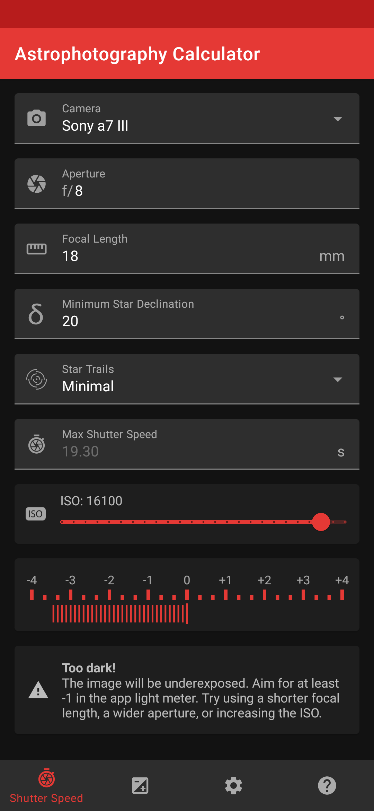

#  Astrophotography Calculator
Simple and intuitive app to calculate the ideal exposure time while shooting astrophotography.

Stars are not fixed in the sky (rather they appear not to because of Earth's rotation), so exposing for too long will start showing motion blur. Calculating the correct exposure time on the field can be tricky, and many approximation rules (e.g.: 400 rule) are often way off from the actual value. This app just solves all of that!

## I'm not convinced, how does it work?
It uses the [NPF rule](https://sahavre.fr/wp/regle-npf-rule/) developed by Frédéric Michaud, using information about the camera sensor and the type of lense you're using to minimize the visible star trails. This mathematical model is extremely more reliable than the 400/500 rule. This apps makes it a lot easier to apply it on the field.

## Some screenshots to prove it's not full of ads?

Here you go:

  
  
  

## Fine, where can I get it?

You can find it on the [Play Store](https://play.google.com/store/apps/details?id=io.github.sirpryderi.astrophotographycalculator).

You can become an early access tester by clicking [here](https://play.google.com/apps/testing/io.github.sirpryderi.astrophotographycalculator) to receive the newest updates and help me improve the app.

You can always download the source from here and build it yourself!
